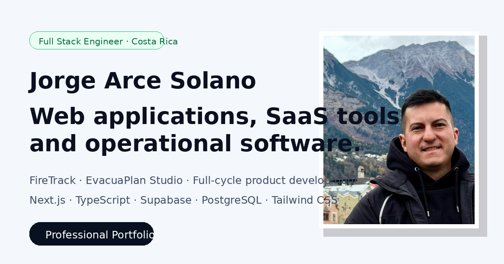

# Jorge Arce Solano — Professional Portfolio

## Live website

- Spanish: https://www.jarcedev.com/es
- English: https://www.jarcedev.com/en

Bilingual professional portfolio presenting my experience developing web applications, SaaS products, operational systems and interactive software.

The website is available in Spanish and English and includes detailed case studies for FireTrack and EvacuaPlan Studio.

## Featured projects

### FireTrack

Multi-tenant SaaS platform for fire extinguisher inventory, inspections, maintenance, QR workflows, alerts, audit records, PDF reports and Excel imports.

My responsibilities included requirements analysis, architecture, frontend and backend development, PostgreSQL database design, Supabase authentication, Row Level Security, testing, deployment and ongoing maintenance.

### EvacuaPlan Studio

Interactive emergency and evacuation plan editor currently in active development.

The editor includes architectural drawing tools, emergency symbols, object transformations, multi-selection, undo and redo workflows, and support for mouse, touchscreen and stylus interaction.

## Main stack

- Next.js
- React
- TypeScript
- Tailwind CSS
- Supabase
- PostgreSQL
- Node.js
- Vercel

## Portfolio features

- Spanish and English versions
- Responsive and mobile-first layout
- Real product screenshots
- Interactive project galleries
- Detailed technical case studies
- Accessible navigation
- Downloadable CV in both languages
- Protected contact form, WhatsApp, LinkedIn and GitHub contact options
- Open Graph metadata, sitemap, robots and web manifest

## Local development

    npm install
    npm run dev

Open http://localhost:3000/es or http://localhost:3000/en.

## Quality checks

    npm run check:encoding
    npm run build

## Repository scope

This repository contains the source code of my personal portfolio.

The FireTrack and EvacuaPlan Studio production repositories are private and are not included here. This public repository contains only sanitized screenshots, descriptions and case-study material intended for professional review.

## Contact

- LinkedIn: https://www.linkedin.com/in/jorge-arce-solano
- GitHub: https://github.com/Jarce003
- WhatsApp: +506 8328-7094

## License

Copyright © 2026 Jorge Arce Solano. All rights reserved.

The source code and visual assets are publicly available for portfolio review. No permission is granted to copy, modify, distribute or reuse them without prior written authorization.
